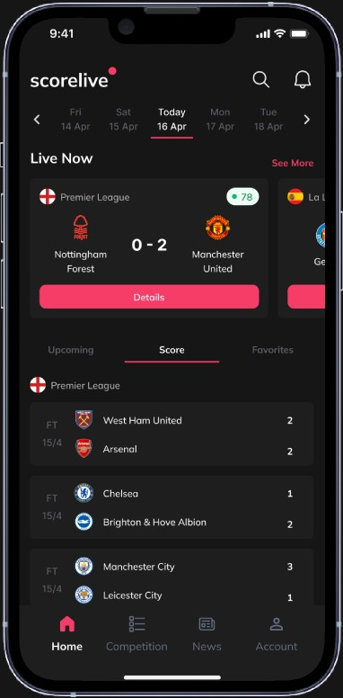
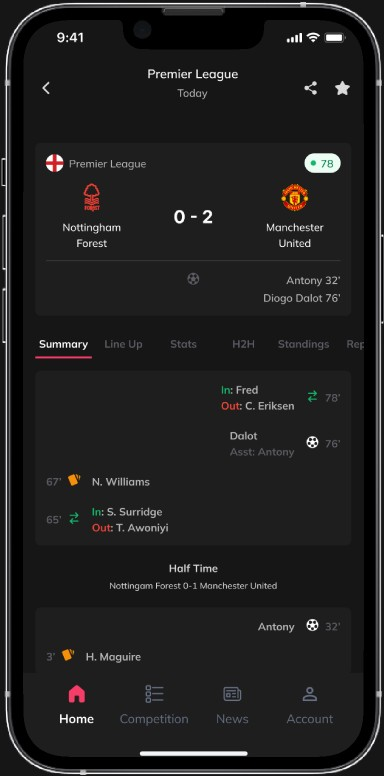
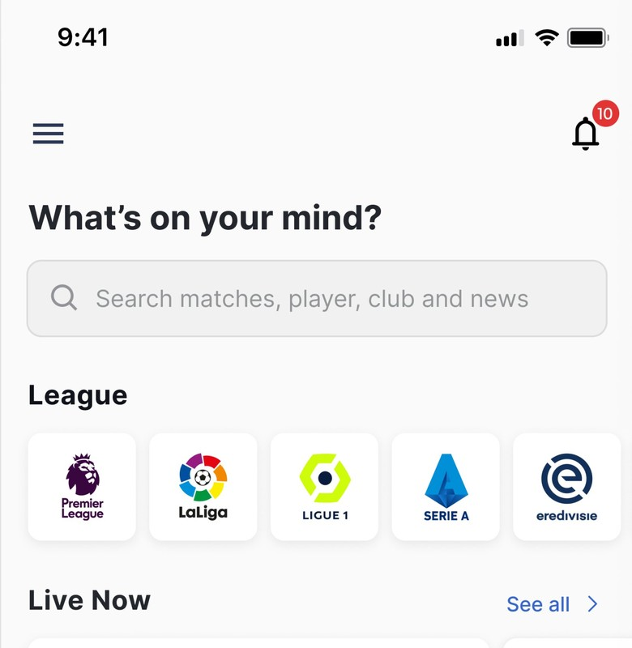
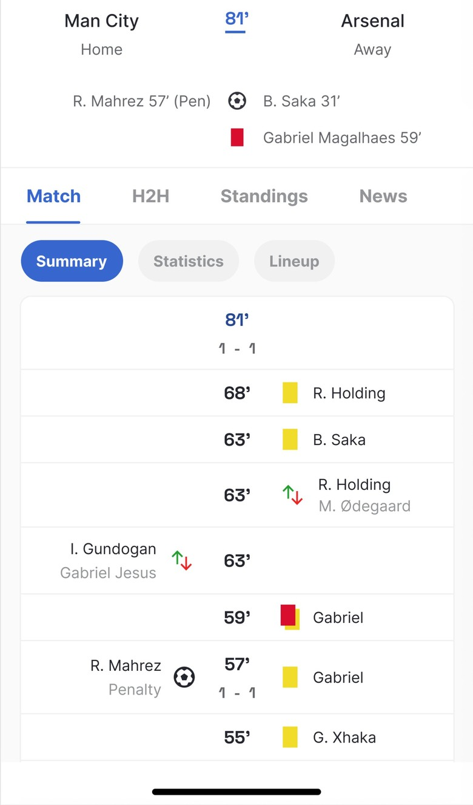
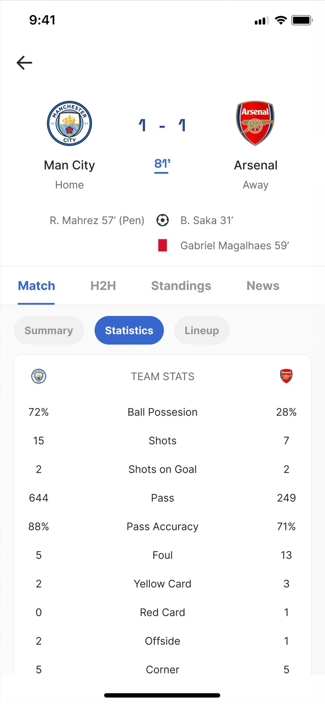
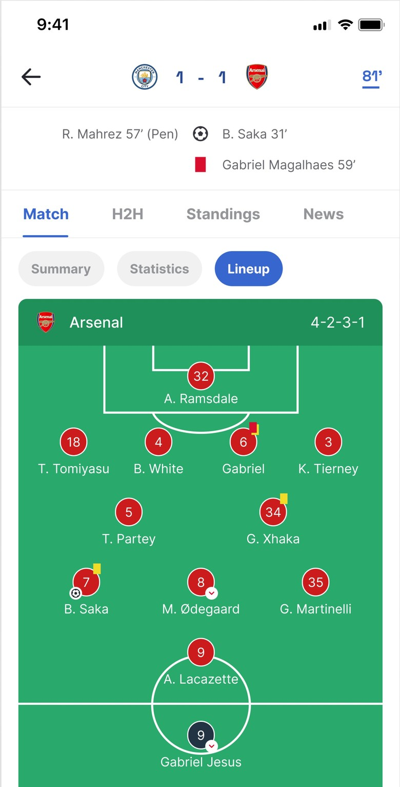

# Figma Community live-score pull

Gallery: [`figma-livescore/index.html`](./figma-livescore/index.html)  
Attribution: [`figma-livescore/README.md`](./figma-livescore/README.md)

Figma MCP was not available on this run, so screens were pulled from **public Community cover and carousel stills** (CC BY 4.0), then cropped to phone frames. Duplicate the source file in Figma if you need Auto Layout layers.

**Do not restyle footballscore to match any kit.** Medal field, copper live, IBM Plex, and shield crests stay in `/DESIGN.md`. This pull is IA and density reference.

## Kits pulled

| Kit | File | Users | Screens in this folder |
| --- | --- | --- | --- |
| [Livesoccer](https://www.figma.com/community/file/1197453857240691089/livesoccer-live-score-mobile-app) — Ravenzu | `1197453857240691089` | 2.6k | Home (top), match summary, stats, lineup |
| [Live Score App UI Kit (scorelive)](https://www.figma.com/community/file/1237711018456644474/live-score-app-ui-kit) — Ariq Alsina | `1237711018456644474` | 2.5k | Home, match summary |
| [Live Score UI KIT](https://www.figma.com/community/file/936495139689782604/live-score-ui-kit-freebies) — Odama Studio | `936495139689782604` | 14.6k | Cover only (12-screen promo, tilted) |
| [Soccer Score App](https://www.figma.com/community/file/1346448737297815031/soccer-score-app) | `1346448737297815031` | 2.5k | Cover only |
| [Football Live Score App (Scorsa)](https://www.figma.com/community/file/1625464853719633701/football-live-score-app) — Maariz | `1625464853719633701` | 259 | Cover only (one home in a hand) |
| [MyScore](https://www.figma.com/community/file/1489287580387622971/myscore) — Merin | `1489287580387622971` | 482 | Cover only |

Betting kits from the same Community search were skipped on purpose.

## Screen inventory

### scorelive — Scores home

Dark field. Wordmark left, search + bell right. **Date rail** (neighbour weekdays + underlined Today). **Live Now** is a discrete elevated card: league + green minute chip + crests + `0–2` + full-width Details. Below that, Upcoming / Score / Favourites. Finished rows are **status left, names, scores stacked on the right**. Four tabs: Home · Competition · News · Account.

### scorelive — Match summary

Sticky scoreboard (league, green `78`, `0–2`, crests, scorers). Segment: Summary / Line Up / Stats / H2H / Standings / Reports. Timeline is a **newest-first event list** with minute, player, assist, in/out colour, yellow card, half-time rule.

### Livesoccer — Home (masthead)

Light paper. Hamburger + badged bell. Display question, then a search field. **League** is a horizontal logo scroller (marks stay marks). **Live Now** header with See all. The live cards themselves are cropped off this Community still.

### Livesoccer — Match summary

Home left / away right in the header. Minute is the center axis (`81′` blue). Scorers and a red-card name sit under the names. Tabs: Match · H2H · Standings · News. Pills: Summary · Statistics · Lineup. The log is a **split timeline**: home events left, minute center, away events right. Goal / card / sub icons, not colour alone.

### Livesoccer — Team stats

Same sticky header. Statistics pill on. Dual column: home value · label · away value. Possession, shots, shots on goal, passes, accuracy, fouls, cards, offside, corners. No xG. No betting strip.

### Livesoccer — Lineup

Same chrome. Lineup pill on. One club’s **4-2-3-1 on a green pitch**, numbered discs, card/goal/sub glyphs on the disc. Formation string in the pitch header.

## What to take for footballscore

Map onto existing Pitch recipes. Do not copy kit chrome.

1. **Date is a rail, not Yesterday/Today/Tomorrow copy.** scorelive underlines the active day. footballscore already uses flap neighbours — keep that, keep the rail compact.
2. **Live is a band, then the day.** scorelive puts Live Now above finished Score rows. footballscore already orders Live → followed → the rest. Do not bury live under FT groups.
3. **Match is one object with a segment, not seven peer tabs.** Both kits: sticky board + Summary/Stats/Lineup. footballscore: timeline default, then Lineup / Numbers / Table / Series.
4. **Timeline is the match story.** scorelive: newest-first cards. Livesoccer: split home/away with the minute as axis. footballscore already chose a single stream, newest first — keep it. Split-column is optional later, not v1 identity.
5. **Stats are dual numbers + a label, not a branded chart.** Livesoccer’s TEAM STATS row is the dual-stat we already specified. Club tint on the bar, not kit-pink or kit-blue.
6. **League marks in a scroller are discovery, not Scores chrome.** Livesoccer’s League row is closer to Explore than to `/matches`. Scores home stays a fixture list.
7. **Status is letters + a reserved score column.** scorelive’s FT + right-stacked scores is readable. footballscore’s stacked tile (home over away, 22px mono) is the signature — do not switch to kit-pink Details buttons.
8. **Live minute is a caption in the live token, with a pulse-able chip.** scorelive uses green. footballscore uses copper. Never system green `#00A651` as identity (already forbidden in DESIGN.md).

## What to leave

- **Watch / Subscribe / Open in TV** — Scorsa’s “Watch Match” navy CTA. Out.
- **Odds, Predict, betting kits** — skipped at source.
- **Multi-sport IA** — Odama’s Soccer / Basketball / Football chips. This product is association football only.
- **Onboarding with a celebrity cutout** and lorem (“Search millions of jobs…”). Odama cover.
- **Circle-cropped crests.** Kits do it constantly. footballscore keeps shields.
- **Kit identity colour as the product.** Pink CTAs, neon lime, purple MyScore, Odama orange. Copper is live only.
- **Jumbotron featured match as the Scores page.** MyScore / Soccer Score App hero cards. List score stays 22px; 32px is match-page only.
- **Player ratings, 3D pitch as default, Account as a 4th tab, News as a peer until articles earn it.**
- **Light iOS grey paper as the Scores canvas.** Livesoccer is useful IA on white; footballscore Scores is Field `#0B0B0D`.
- **Fake clubs or invented minutes.** Templates invent Premier League rows. ESPN data only.

## Closest mapping onto Pitch

| Pitch component | Closest kit screen | Keep from kit | Reject from kit |
| --- | --- | --- | --- |
| `date-board` | scorelive home rail | Neighbour days + one active | Pink underline as brand |
| `live-rail` / Live Now | scorelive Live Now card | Band above FT | Full-width Details CTA |
| `match-row` | scorelive Score list | FT + stacked scores | Circle crests, grey FT only |
| `sticky-scoreboard` | both match headers | Minute + score + scorers | Green minute, huge 28px on list |
| `timeline` | scorelive summary | Newest-first events | Split-column as default |
| `dual-stat` | Livesoccer stats | Label between values | Blue as the number colour |
| `lineup` | Livesoccer pitch | Formation string + event glyphs | Pitch as the only lineup view |
| `tab-bar` | scorelive 4 tabs | Four destinations | Account + News as peers |

## Do / Don't (for agents using this pull)

### Do
- Open the [gallery](./figma-livescore/index.html) before touching Scores or Match chrome.
- Steal **structure**: date rail, live band, sticky board, segment, dual-stat, honest empty stats.
- Keep IBM Plex Mono tabular on the board. Keep copper on the live minute only.

### Don't
- Don't paste kit-pink, kit-blue, or neon lime into `globals.css`.
- Don't add Watch, odds, or a Sign in splash from Odama.
- Don't circle-crop ESPN crests because the template did.
- Don't treat Community covers as production data — clubs and minutes on these stills are dummy.

## Known gaps

- Community stills are marketing crops, not the full 10–15 frame kits. Duplicate the Figma file for Auto Layout, variants, and missing screens (standings table, H2H, schedule).
- Livesoccer home live cards and the La Liga schedule phone were not separable from the 6400×4800 collage without overlap.
- Odama, Soccer Score App, Scorsa, and MyScore remain cover-only (perspective or single-hero stills).
- No Figma node IDs — MCP tool discovery failed on this agent run.
---
