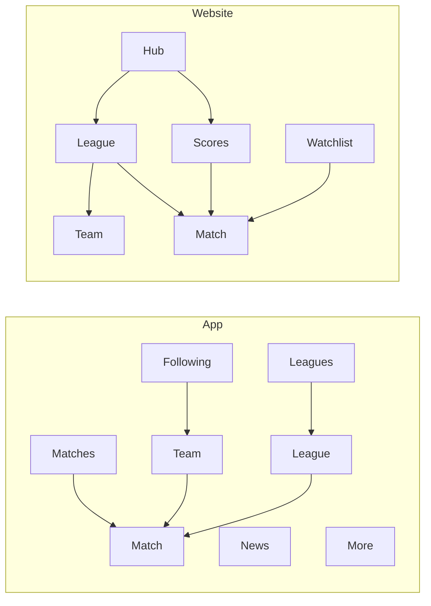

# footballscore — screen-by-screen UI spec

Football-only live scores product. Two surfaces, one information model.

| Surface | Source of truth | What we copy |
| --- | --- | --- |
| **App (iOS / mobile web)** | [FotMob](https://mobbin.com/apps/fotmob-ios) | Tabs, match list, match detail, leagues, following |
| **Website (desktop)** | [X Sports](https://mobbin.com/screens/c6f41164-e395-47af-af4d-3f70de48fa58) + [Perplexity Sports](https://mobbin.com/flows/c032af92-2512-49ac-ae18-2ae86593def0) | 3-column chrome, live list + score cards, league hub |

Betting, streaming CTAs, and non-football sports are **out of scope**. Data, labels, and football semantics always follow FotMob — even on the website.

---

## 1. Product map



Same objects on both surfaces: **Match, League, Team, Player, News**. Routes below are canonical.

| Object | App | Website |
| --- | --- | --- |
| Match list | `/matches` | `/scores` |
| Match | `/match/:id` | `/match/:id` |
| Leagues index | `/leagues` | `/` and `/leagues` |
| League | `/league/:id` | `/league/:id` |
| Team | `/team/:id` | `/team/:id` |
| Player | `/player/:id` | `/player/:id` |
| Following / watchlist | `/following` | `/watchlist` |
| News | `/news` | `/news` |
| Settings | `/more` | `/settings` |

Mobile viewport (`<768px`) on the website uses the **app** layouts, not a squeezed 3-column desktop.

---

## 2. Design system

### Tokens (FotMob-led)

| Token | Value | Use |
| --- | --- | --- |
| `--bg` | `#F2F2F7` | Page background |
| `--surface` | `#FFFFFF` | Cards, tab bar |
| `--ink` | `#111111` | Primary text, active tab |
| `--muted` | `#6B7280` | Meta, kickoff, FT |
| `--line` | `#E5E7EB` | Dividers |
| `--accent` | `#00A651` | Follow, live football, primary actions |
| `--live` | `#00A651` | Live minute, Live badge |
| `--danger` | `#FF3B30` | Remove / unfollow |
| `--qualify-cl` | `#00A651` | Table rail: Champions League |
| `--qualify-el` | `#2563EB` | Table rail: Europa League |
| `--qualify-rel` | `#DC2626` | Table rail: relegation |
| `--radius-card` | `12px` | Cards |
| `--radius-pill` | `999px` | Filters, Follow, FT |
| `--space` | `16px` | Screen gutter |

League/team profile headers tint to the competition or club color (Premier League purple, Bayern red). Body stays light.

Website chrome (from Perplexity): more whitespace, thinner type, no colored league headers in the global shell. League color appears only inside the league page header band.

### Type

- App: SF Pro / system sans. Large title 34 bold on tab roots. Body 16. Meta 13 muted.
- Web: same family. Page title 28–32. Table 14. News headline 18–22.

### Status language (never mix)

| State | Badge | Score | Time |
| --- | --- | --- | --- |
| Not started | none | kickoff time centered | local time |
| Live | green `LIVE` + minute (`67'`, `45+2'`) | score in `--ink` | minute in `--live` |
| HT | grey `HT` | score | — |
| FT | grey `FT` | score | — |
| Postponed / abandoned | grey `PP` / `AB` | `—` | — |

Home team always **left** on mobile lists and **left** on desktop scoreboards.

---

## 3. Shared components

| Component | App | Web |
| --- | --- | --- |
| **MatchRow** | Home left, score/time center, away right. Optional TV / bell trailing. | Same row, plus optional Watch-less “Open” on hover. |
| **LeagueGroup** | Card: flag + league name header, then MatchRows. Collapse control “Hide all”. | Same grouping under a sticky league subhead. |
| **ScoreCard** | Not on FotMob home. | Horizontal scroller of team-color cards (from X Sports). |
| **FollowButton** | Green text “Follow” / filled “Following”. | Same, quieter outline on web. |
| **DateStrip** | Today / Yesterday / Tomorrow + calendar dates, underline on selected. | Day chips under Scores header. |
| **StickyMatchHeader** | Logos, score or kickoff, countdown. Tabs below. | Same header spanning center column. |
| **Table** | `# Team PL W D L +/- GD PTS`. Left color rail for qualification. | Same columns; Highlight current team row. |
| **FormPills** | Green / grey / red score chips + opponent crest. | Same in sidebar or team page. |
| **SearchField** | Rounded, placeholder “Find leagues”. | Hub search: “Search teams, players, leagues”. |

---

## 4. App screens (FotMob)

Bottom tab bar, 5 items, always visible except on match/team/league pushed screens (those keep a back chevron).

```
[ Matches ] [ News ] [ Leagues ] [ Following ] [ More ]
   pitch      paper     trophy        star       ≡
```

Active = filled `--ink`. Inactive = `--muted`.

---

### A1 — Matches (home)

**Route:** `/matches`  
**Refs:** [FotMob matches](https://mobbin.com/screens/7218059e-c194-4c92-a0a4-1294045af4a0) · [flow: match detail](https://mobbin.com/flows/0e1f4f3a-2284-4c4e-8f71-ea64296de107)

```
┌─────────────────────────────────┐
│ FOTBALLSCORE          ⏱  ⌕  📅 │
│ Today  Yesterday  Tomorrow  ▸   │
├─────────────────────────────────┤
│ 🇺🇸 Major League Soccer          │
│ Seattle Sounders     10:45 AM  Minnesota │
├─────────────────────────────────┤
│ 🏴󠁧󠁢󠁥󠁮󠁧󠁿 Premier League               │
│ Sunderland    FT  1 - 1  Everton│
│ ...                             │
│            [ Hide all ]         │
└─────────────────────────────────┘
│ Matches  News  Leagues  Follow… │
```

**Chrome**
- Large wordmark left. Right: recents, search, calendar (date badge if a non-today day is selected).
- DateStrip under chrome.

**Body**
- Vertical list of **LeagueGroup** cards.
- Order: followed leagues first (user order from A3), then rest by region.
- Each row is **MatchRow**. Tap → A6 Match.
- “Hide all” collapses finished groups for the selected day.

**Empty:** “No matches this day.” + jump to Today.  
**Loading:** skeleton LeagueGroups (3 cards).  
**Error:** inline retry on the list.

---

### A2 — News

**Route:** `/news`  
**Ref:** [FotMob news](https://mobbin.com/screens/714b46d5-6d14-4e30-b1b4-f7156ce6db2b)

```
┌─────────────────────────────────┐
│ News                     Follow │
│ For you  Following  Leagues     │
├─────────────────────────────────┤
│ ┌─────┐ Headline                │
│ │ img │ source · 2h             │
│ └─────┘                         │
│ ┌─────┐ Headline                │
│ │ img │                         │
└─────────────────────────────────┘
```

- Tabs: **For you** (followed teams/leagues), **Following**, **Leagues**.
- Cards: 16:9 thumb, headline, source, relative time. Tap → in-app article or `/news/:id`.
- Pull to refresh.

---

### A3 — Leagues index

**Route:** `/leagues`  
**Refs:** [Leagues list](https://mobbin.com/screens/91bcc715-26e5-4907-b85d-158230b8e84b) · [edit mode](https://mobbin.com/screens/7235e674-d4d2-436a-ba7e-0baed5414be5)

```
┌─────────────────────────────────┐
│ Leagues                         │
│ 🔍 Find leagues                 │
│ Following                  Edit │
│ 🦁 Premier League               │
│ ⭐ Champions League             │
│ Suggested        Don't show again│
│ 🔴 Bundesliga          [Follow] │
│ All competitions                │
│ 🌍 International ▸              │
│ 🏴󠁧󠁢󠁥󠁮󠁧󠁿 England ▸                     │
└─────────────────────────────────┘
```

**Default**
- Search.
- **Following**: logo + name. Edit (green).
- **Suggested**: logo + name + Follow. Dismiss section.
- **All competitions**: country accordion.

**Edit**
- Red minus to unfollow, drag handles to reorder. Done (green).
- Followed order here **is** the Matches tab group order.

Tap a league → A4.

---

### A4 — League

**Route:** `/league/:id`  
**Refs:** [Table](https://mobbin.com/screens/2d3e370c-7780-4b5f-9f3c-133a91b6c063) · [Fixtures](https://mobbin.com/screens/b8f1280b-9c43-4b30-9ee9-cb9065639331) · [Player stats](https://mobbin.com/screens/80755844-ec6f-4271-985f-3f5661274705) · [Team stats](https://mobbin.com/screens/7963e106-12d0-4d9a-b107-3589e7bfe86c)

**Header (league color)**
- Back. Season dropdown (`2025/2026`). Bell. Follow / Following.
- Crest, league name, country.

**Tabs (scroll):** `Table` · `Fixtures` · `News` · `Player stats` · `Team stats` · `Transfers`

#### A4.1 Table

- Pills: **Short** | **Full** | **Form**. Dropdown: Overall / Home / Away.
- Full columns: `# Team PL W D L +/- GD PTS`.
- Short: `# Team GD PTS`.
- Form: last-5 pills instead of W/D/L.
- Left rail: CL green (1–4), EL blue, relegation red.
- Tap team → A5.

#### A4.2 Fixtures

- Pills: **Date** | **Round** | **Team ▾**.
- Groups by date. Row: home · time-or-score · away. Trailing bell / TV.
- Live rows use live styling from §2.

#### A4.3 Player stats / Team stats

- Stack of cards: “Top scorer”, “Assists”, “Goals per match”, …
- Top 3 rows. Leader value in a tinted pill. Chevron → full leaderboard.

---

### A5 — Team

**Route:** `/team/:id`  
**Refs:** [Overview](https://mobbin.com/screens/40862666-0469-41c3-87c4-5e53351a71b7) · [Matches](https://mobbin.com/screens/6c98b67b-d3f9-46ae-ac07-5ba3564f085d) · [Table on team](https://mobbin.com/screens/00af7704-93ea-412b-91d4-eb5fff35bd6e)

**Header (club color)**
- Back. Notifications. Follow / Following.
- Crest, name, country.

**Tabs:** `Overview` · `News` · `Matches` · `Table` · `Stats`

**Overview cards (in order)**
1. Next match — date, competition pill, home vs away, time.
2. Team form — last 5 (tap → expanded).
3. Daily summary — short text, “More”.
4. Mini table — current league, this team row highlighted.
5. Tournaments list.
6. Stadium — name, city, surface / capacity / opened, map pin.
7. Sync fixtures → calendar.

Toast after notification change: “Notifications for {team} changed”.

**Matches tab:** Today’s result card, then Upcoming list (date groups, competition pills).

---

### A6 — Match

**Route:** `/match/:id`  
**Refs:** [Match detail flow](https://mobbin.com/flows/0e1f4f3a-2284-4c4e-8f71-ea64296de107) · [Commentary](https://mobbin.com/flows/48c5124b-08fb-45a5-9a2c-f4f3d93c8bb3) · [Preview](https://mobbin.com/flows/bd484f37-81f2-4c04-a27c-c9c4bdbee82f)

**Sticky header**
- Back, share, bell, star.
- Home crest + name | score or kickoff + countdown | away.
- Competition / leg badge (`2nd leg`) when relevant.

**Tabs depend on state**

| Before kickoff | Live / FT |
| --- | --- |
| Preview, Lineup, Knockout*, Stats, H2H | Overview / Facts, Commentary, Lineup, Table, Stats, H2H, Knockout* |

\*Knockout only for cups.

#### A6.1 Preview (pre-match)

- Who will win? — 3 vote buttons (home / draw / away) + vote count.
- Related news row.
- Venue — stadium, city, capacity, surface, weather.
- Broadcast list (names only, no paywall CTA).
- Referee.
- Team form (two columns).
- Insights — one-line facts.

#### A6.2 Overview / Facts (in-play / FT)

- Key events (goals, cards, subs) with minute.
- Score, HT score, possession bar.
- Jump links into Commentary / Stats.

#### A6.3 Commentary

- Optional mini pitch graphic.
- Toggle “Only key events”.
- Newest-first cards: `90+7 FULL-TIME`, yellow-card card with player chip, goal card:
  - Green minute + “Goal!”
  - Narrative
  - Player chip (photo, club, ball icon)
  - Shot map + xG / xGOT / foot / situation

#### A6.4 Lineup

- Filter chips: Market value, Age, Country.
- Pitch, formation label (`4-2-3-1`), player photo + number + name.
- Bench lists below.
- Default to home team; swipe or toggle for away.

#### A6.5 Stats

- Dual bars: possession, shots, shots on target, corners, fouls, xG.

#### A6.6 H2H

- Won / Drawn / Won circles + ratio bar.
- Filters: Home, Tournament.
- Past meetings: date, competition pill, score.

#### A6.7 Table

- Same as A4.1, current match teams highlighted.

---

### A7 — Following

**Route:** `/following`  
**Refs:** [Teams grid](https://mobbin.com/screens/65ae8693-b729-45e2-851c-fff6470c61d0) · [Empty suggested](https://mobbin.com/screens/a9dffe56-aa54-4008-b005-4d0edb64d253) · [Players](https://mobbin.com/screens/91f25fe7-bdf9-496b-ba99-13aeb42b429c)

```
┌─────────────────────────────────┐
│ Following              Edit  +  │
│ Teams     Players               │
│ ┌──────────┐ ┌──────────┐       │
│ │ Man Utd  │ │ Liverpool│       │
│ │ next fx  │ │ next fx  │       │
│ └──────────┘ └──────────┘       │
│ Suggested        Don't show again│
│ Chelsea                 [Follow]│
└─────────────────────────────────┘
```

**Teams**
- 2-column cards, **club color fill**, white type, crest.
- Home = stadium icon; away = airplane. Next opponent + date/time.
- Tap card → A5. `+` → search to follow.
- Empty: suggested list with Follow.

**Players**
- Featured player card (club color, photo, name, club, number, goals).
- Suggested player rows (photo + nested club mark + Follow).

---

### A8 — More

**Route:** `/more`  
**Ref:** [FotMob More](https://mobbin.com/flows/923fdc2d-30f7-42f9-bfa7-c727e20c4ba8)

Large title “More”. Rows:

| Row | Subtitle |
| --- | --- |
| Account | Sign in / avatar |
| Notifications | Teams, players, leagues |
| TV schedules | Region |
| Settings | Appearance, start tab, time format |
| About | Version |

TV schedules (push): date strip + rows of time, Live, teams, broadcaster names.

---

### A9 — First launch (app)

1. Welcome + continue.
2. Pick leagues (search + popular chips). Minimum 1.
3. Optional: pick teams.
4. Land on A1 with those groups first.

Skip allowed; then A3 Suggested fills the gap.

---

## 5. Website screens (X Sports + Perplexity Sports)

Desktop ≥ 1100px uses this chrome. 768–1099: collapse right rail. `<768`: app layouts.

### Global chrome

**From Perplexity Sports:** icon rail + airy content.  
**From X Sports:** scores density in the center column.

```
┌────┬────────────────────────────┬──────────────────┐
│ FS │  footballscore    Search   │  Watchlist  Acc  │
│ ⚽ │                            │                  │
│ 📊 │  page content              │  right rail      │
│ 🏆 │                            │                  │
│ ★  │                            │                  │
│ ☰  │                            │                  │
└────┴────────────────────────────┴──────────────────┘
```

**Left rail**
- Logo
- Scores
- Leagues (hub)
- Watchlist
- News
- Search (or header search)

**Header**
- Breadcrumb (`footballscore > Premier League`)
- Search: “Search teams, players, leagues”
- Create Watchlist / Share on hub only

**Right rail (contextual)**
- On hub: What’s happening (news cards)
- On scores: mini table of selected league
- On match: standings snippet + H2H
- On league: in-page nav (Schedule, Table, Stats, News)

---

### W1 — Hub

**Route:** `/`  
**Refs:** [Perplexity Sports hub](https://mobbin.com/flows/c032af92-2512-49ac-ae18-2ae86593def0) · [league grid](https://mobbin.com/screens/c0bf79a6-0372-42b3-ab0f-ed4600d2f668)

```
footballscore                          [Watchlist] [Share]

            🔍 Search teams, players, leagues

What's happening          Updated 4 min ago
┌──────────┐ ┌──────────┐ ┌──────────┐
│ news     │ │ news     │ │ news     │
└──────────┘ └──────────┘ └──────────┘

Live now
[ ScoreCard ] [ ScoreCard ] [ ScoreCard ] →

Active
┌ Premier League  Active ▸ ┐ ┌ La Liga  Active ▸ ┐
└ Soccer                   ┘ └ Soccer            ┘

Off-season
┌ MLS  Off-season ▸ ┐
```

- News carousel: logos, relative time, headline, 2-line summary.
- Live now: X-style **ScoreCards** (club colors, abbreviations, score, `Live · 67'`).
- League cards: crest, name, “Soccer”, status badge. Football only. Active vs Off-season.
- Watchlist CTA copies Perplexity “Create Watchlist” → W6.

---

### W2 — Scores

**Route:** `/scores`  
**Refs:** [X Sports schedule](https://mobbin.com/screens/c6f41164-e395-47af-af4d-3f70de48fa58) · [league flow](https://mobbin.com/flows/7f274f9a-6336-41f3-909a-6b0a79b55226)

Center column:

1. DateStrip + league chips (All, followed leagues).
2. **Live** subhead + MatchRows (minute in `--live`, no Watch/odds).
3. Horizontal **ScoreCard** scroller for live + next featured.
4. Rest of day grouped by **LeagueGroup** (FotMob grouping).
5. Optional “Full table” banner per league → W3.

Row anatomy (X, footballized):

```
[crest] Arsenal          67'     2
[crest] Chelsea                  1
```

Click row → W4. Hover: faint surface, no video button.

Right rail: selected or first followed league mini-table (top 6 + “Full table”).

---

### W3 — League

**Route:** `/league/:id`  
**Refs:** [X standings](https://mobbin.com/flows/7f274f9a-6336-41f3-909a-6b0a79b55226) · [Perplexity league](https://mobbin.com/flows/e432dd14-e10f-4e82-9c38-797541c92b38)

```
footballscore > Premier League                    [Follow] [Share]

[ Schedule ] [ Table ] [ Stats ] [ News ]

                    right: Schedule
                           Table     ←
                           Stats
                           News
```

- **Schedule:** FotMob A4.2 content in the center (date groups).
- **Table:** Full FotMob table; current user teams highlighted.
- **Stats:** Two columns — Player stats cards | Team stats cards (A4.3).
- **News:** Perplexity pattern — headline, summary, “Updated Ns ago”, source count. No AI citation chips required in v1.

---

### W4 — Match

**Route:** `/match/:id`  
**Refs:** [X match detail](https://mobbin.com/flows/d3db3bd3-d9b2-482e-b44f-77273901fe13) · FotMob A6 for football modules

Center:

1. Scoreboard — crests, `2 - 1`, `67'` in `--live` (or kickoff + countdown).
2. Period strip for football: `1` | `2` | `FT` (goals per half), not NBA quarters.
3. Related: club + league links (avatars, no social network).
4. In-page sections (same data as A6): Events, Lineup (pitch or list at desktop width), Stats bars, H2H, Box-less player list (goals, assists, cards).
5. Commentary as a right-or-below feed on wide screens.

**Do not ship** X’s Odds / Watch / Grok blocks.

Right rail: mini table + “Who will win” poll pre-match.

---

### W5 — Team

**Route:** `/team/:id`

Perplexity page frame + FotMob A5 modules in the center: next match, form, mini table, fixtures, stadium. Header uses club color band (app) at ~120px height, then white body.

---

### W6 — Watchlist

**Route:** `/watchlist`

Web equivalent of A7.

- Teams as a responsive grid of club-color cards (2–4 columns).
- Players as a list.
- Empty: suggested teams + “Browse leagues” (W1).
- Followed items drive W2 default chips and hub “Live now” priority.

---

### W7 — News index / article

**Route:** `/news`, `/news/:id`

Perplexity Discover-style: featured horizontal card, then 3-column grid of thumbs + headlines. Right rail can show live ScoreCards. Article: headline, source, time, body, related matches.

---

## 6. Screen-by-screen parity

| Job | App | Web |
| --- | --- | --- |
| Scan today’s scores | A1 | W2 |
| Discover leagues | A3 | W1 |
| Follow a club | A7 / A5 | W6 / W5 |
| Open a live match | A6 | W4 |
| Read a table | A4.1 | W3 Table |
| Lineup + commentary | A6.4 / A6.3 | W4 sections |
| First-run personalization | A9 | W1 watchlist CTA |

If a module exists in FotMob and is football-relevant, it appears on **both** surfaces. Web never adds modules FotMob does not have (odds, watch, multi-sport).

---

## 7. Interaction rules

1. **Optimistic follow.** Button flips immediately; revert on error.
2. **Live updates.** Scores, minutes, commentary poll ≤ 15s while the match page or scores list is visible.
3. **Deep links.** `/match/:id` opens the same match on app and web.
4. **Back.** App: native stack. Web: breadcrumb + browser back.
5. **Time.** User timezone. Settings toggle 12h / 24h.
6. **Crests.** Never crop into a circle if the mark is a shield; use 24–32px app, 28–40px web.
7. **Accessibility.** Live minute announced as text, not color alone. Table rails have a legend. Contrast on club-color cards: white text only when the fill is dark; otherwise ink on a 12% tint.

---

## 8. MVP vs later

**MVP (ship first)**  
A1, A6 (Preview + Overview + Commentary + Lineup + Stats + H2H), A3, A4 (Table + Fixtures), A5 Overview, A7 Teams, A9.  
W1, W2, W3 (Schedule + Table), W4 (scoreboard + events + stats + H2H), W6.

**v1.1**  
News (A2, W7), Player stats, TV schedules, Players following, Knockout trees, calendar sync.

**Explicitly never**  
Betting modules, live video, non-football sports, X-style “Watch” on football rows.

---

## 9. Source index (Mobbin)

| Use | Link |
| --- | --- |
| App home | https://mobbin.com/screens/7218059e-c194-4c92-a0a4-1294045af4a0 |
| Match detail flow | https://mobbin.com/flows/0e1f4f3a-2284-4c4e-8f71-ea64296de107 |
| Commentary | https://mobbin.com/flows/48c5124b-08fb-45a5-9a2c-f4f3d93c8bb3 |
| Preview | https://mobbin.com/flows/bd484f37-81f2-4c04-a27c-c9c4bdbee82f |
| Leagues | https://mobbin.com/screens/91bcc715-26e5-4907-b85d-158230b8e84b |
| League table | https://mobbin.com/screens/2d3e370c-7780-4b5f-9f3c-133a91b6c063 |
| League fixtures | https://mobbin.com/screens/b8f1280b-9c43-4b30-9ee9-cb9065639331 |
| Following teams | https://mobbin.com/screens/65ae8693-b729-45e2-851c-fff6470c61d0 |
| Team overview | https://mobbin.com/screens/40862666-0469-41c3-87c4-5e53351a71b7 |
| Web scores | https://mobbin.com/screens/c6f41164-e395-47af-af4d-3f70de48fa58 |
| Web match | https://mobbin.com/flows/d3db3bd3-d9b2-482e-b44f-77273901fe13 |
| Web league tabs | https://mobbin.com/flows/7f274f9a-6336-41f3-909a-6b0a79b55226 |
| Web hub | https://mobbin.com/flows/c032af92-2512-49ac-ae18-2ae86593def0 |
| Web league page | https://mobbin.com/flows/e432dd14-e10f-4e82-9c38-797541c92b38 |
